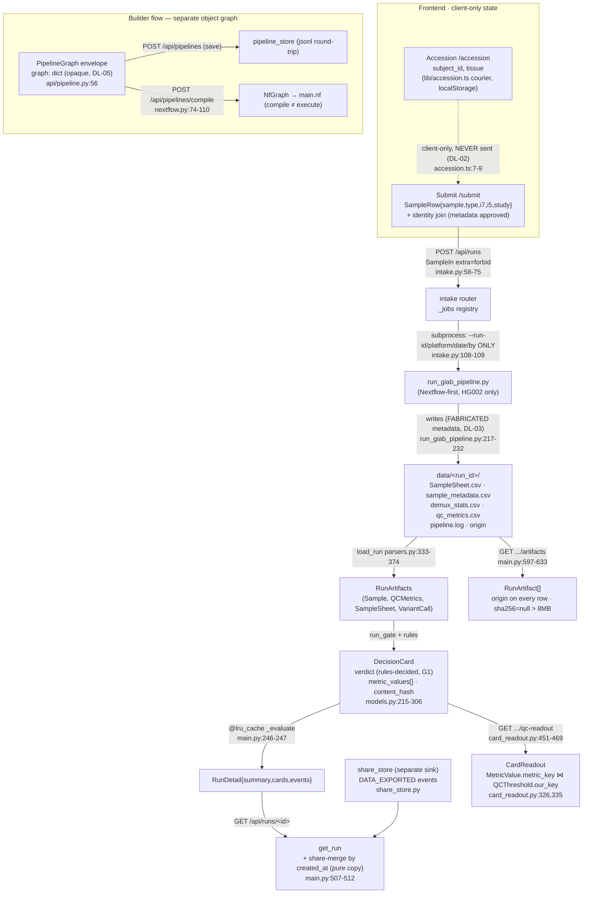

## PipeGuard Release-Hardening Audit — Specialist 2: Data-movement / lineage

**Run mode:** Fable 5, **code-only / headless** (route + `file:line` + quoted string; no browser this pass, per the resolved evidence block in `AUDIT_PLAN.md:26`).
**Scope traced:** `types.ts` ⇄ `api/main.py` + routers + `src/pipeguard/models.py`; the Submit→`POST /api/runs`→driver→`data/<run_id>/`→cards→qc-readout→provenance→share chain; the five off-gate stores; the compile/run graph envelope.
**Headline:** no Blockers. The gate-decision lineage (content_hash purity, metric join keys, share-merge cache purity, origin tagging) is **honest and correct**. The real signal is a cluster of **hand-kept `types.ts` drift** (one named, high-value) plus a **live-intake metadata-fabrication seam** where operator-entered sample metadata never reaches disk and is replaced by a hardcoded value. Every claim below was re-opened and the quoted string re-confirmed.

Guardrail note (G1): nothing here recommends letting any agent or projection set a verdict/confidence — all findings are contract/lineage integrity only.

---

### Findings (ranked; Blockers first — none)

#### DL-01 · MonitoringSignature `types.ts` contract lies ("NOT yet served") and omits a served field · **High** · Confirmed · design-inconsistency
- **Evidence (producer):** `api/main.py:1255-1258` serves `first_seen`/`last_seen`, `trend: Literal["up","down","flat"] = "flat"` (non-optional), `affected_run_ids: list[str] = Field(default_factory=list)`; populated at `api/main.py:1410-1413`.
- **Evidence (consumer):** `frontend/src/types.ts:346` comment `"// first_seen/last_seen/trend are NOT yet served (F2) — kept optional…"`; the `MonitoringSignature` type (`types.ts:348-357`) **omits `affected_run_ids` entirely** and types `trend?: 'up' | 'down' | 'flat' | null` as optional/nullable.
- **Actual:** The canonical hand-kept type is factually wrong — the backend *does* serve all four fields. Because `affected_run_ids` is untyped, `MonitoringSignatureRow.tsx:10` must smuggle it back with a local cast `type SignatureWithRuns = MonitoringSignature & { affected_run_ids?: string[] }` and read it at `MonitoringSignatureRow.tsx:60` `(sig as SignatureWithRuns).affected_run_ids ?? []`.
- **Render impact (quantified):** **None at runtime** — the "Affected runs" deep-link chips (`MonitoringSignatureRow.tsx:138-155`), first→last range (`:112-116`), and trend glyph (`:126-130`) all render correctly, because the component works around the frozen type with an `as` cast and the backend always sends a value. The defect is **contract-truth**: the type actively misdocuments the wire, and any *other* consumer reading `sig.affected_run_ids` off the typed object is a TS error, forcing more casts.
- **Expected:** `types.ts` `MonitoringSignature` declares `first_seen: string|null`, `last_seen: string|null`, `trend: 'up'|'down'|'flat'`, `affected_run_ids: string[]`; the stale F2 comment is deleted so the component drops its cast.
- **Root cause:** hand-kept TS mirror (`types.ts:1`) lagged an additive backend change (the four fields are documented as "ADDITIVE fidelity" at `api/main.py:1238-1247`).
- **Min fix:** update the six lines in `types.ts:346-357`; remove the `SignatureWithRuns` cast in `MonitoringSignatureRow.tsx:10,60`. **~15 min.**
- **Demo-critical:** N (Monitoring is a golden-path screen but renders correctly today). **Fix risk:** trivial (type-only). **Regression test:** a contract test asserting `keys(MonitoringSignature payload) ⊆ TS type keys` for `GET /api/monitoring`.

#### DL-02 · Operator sample metadata never crosses the `POST /api/runs` boundary · **Medium** · Confirmed · incomplete-integration
- **Evidence:** `api/routers/intake.py:58-64` `SampleIn(model_config=ConfigDict(extra="forbid"))` declares only `sample/type/i7/i5/study` — **no `subject_id`/`tissue`**. The Accession courier is deliberately client-side: `frontend/src/lib/accession.ts:7-9` "subject identifiers … stay CLIENT-SIDE … `SampleIn` … has no subject field and is `extra="forbid"`, so it would reject one." The localStorage courier carries only `{subject_id, tissue}` (`accession.ts:108-121`).
- **Actual:** subject_id/tissue entered in Accession are parsed (`parsers.py:82-83`) and shown in Submit's identity-join, but they **never reach the server** — no wire path exists. This is an *honestly labelled* seam (the courier comment names it), so it does not silently 422; it silently stays client-only.
- **Expected / min fix:** because the label is honest, the minimum action is to keep the seam documented and ensure the Submit identity-join UI does not imply server persistence (cross-ref Specialist 3). If persistence is wanted, it is a `SampleIn` + driver change (post-hackathon).
- **Demo-critical:** N (recording uses pre-gated `data/mock_run_01`). **Fix risk:** n/a (documentation). **Regression test:** assert `SampleIn` rejects a `subject_id` field with 422 (locks the boundary).

#### DL-03 · Live-intake driver fabricates `sample_metadata.csv`, overriding the operator's sample type · **Medium** · Confirmed · confirmed-defect
- **Evidence:** `api/routers/intake.py:108-109` invokes the driver with only `--run-id/--platform/--run-date/--submitted-by` — the samples' `type` (and any subject data) are **not passed**. The driver then hardcodes the metadata: `scripts/run_giab_pipeline.py:217-221` writes `sample_metadata.csv` as `"{cfg.sample},{cfg.sample},blood,PCR-free,{cfg.submitted_by}"` (i.e. `subject_id = sample_id`, `tissue = "blood"`, `library_prep = "PCR-free"`) for **every** submitted run.
- **Actual:** The card header's `sample_type` is sourced from this file (`api/card_readout.py:388` `sample_type = sample.tissue`, via `parsers.py:83`), so a submitted run's card reads `tissue: blood` regardless of what the operator selected in Submit. Whatever sample type the operator picked is dropped, not surfaced, and silently replaced by a contrived constant.
- **Mitigations (honest framing):** only `HG002` is processable (`intake.py:41` `_FIXTURE_SAMPLES = {"HG002"}`), and HG002's real values *are* blood / PCR-free, so no wrong data surfaces for the one runnable sample today; the recording default is `mock_run_01`, not the driver path.
- **Expected:** the run's `sample_metadata.csv` reflects the submitted `type` (and, if persisted, subject fields), or the card header marks the value as fixture-derived rather than operator-supplied.
- **Root cause:** demo-scoped driver writes fixture metadata; the intake router does not forward per-sample fields.
- **Min fix (if kept in-scope):** pass the submitted `type` through `intake.py` → driver arg → the `sample_metadata.csv` write, or add an `origin`-style note that the metadata is fixture-authored. **30–90 min.** **Fix risk:** low-moderate (touches the live driver — a maintainer-edited surface; prefer a note over rewiring before submission).
- **Demo-critical:** N. **Regression test:** submit a run with `type != blood`, assert the resulting `sample_metadata.csv` (or card header) does not report `blood`.

#### DL-04 · `GET /api/config` frontend `Runbook`/`QCThreshold` types omit fields the backend now serves · **Low** · Confirmed · design-inconsistency
- **Evidence (producer):** `GET /api/config` returns `DEFAULT_RUNBOOK.model_dump()` (`api/main.py:662`); the backend `QCThreshold` now carries `our_key` (`src/pipeguard/runbook.py:26`) and `required` (`runbook.py:42`), and `Runbook` carries `trace_failure_statuses` (`runbook.py:174`) and `route_to_human` (`runbook.py:178`).
- **Evidence (consumer):** `frontend/src/types.ts:223-231` `QCThreshold` declares only `metric/label/gate/hard_fail/higher_is_better/borderline_band/unit` (no `our_key`, no `required`); `types.ts:233-238` `Runbook` omits `trace_failure_statuses` and `route_to_human`.
- **Actual:** **Benign at runtime** — the sole `api.config()` consumer (`frontend/src/screens/Intake.tsx:72,79`) joins by the `metric` field via a hardcoded `RUN_TILES` map (`Intake.tsx:29-35`) and never reads the missing fields; TS structural typing ignores the extra JSON keys. Still a real drift that could mislead the next consumer (e.g. one reaching for `our_key` off `/api/config`).
- **Min fix:** mirror the four fields onto the `types.ts` `Runbook`/`QCThreshold`, or add a comment that `/api/config` is the raw core shape. **~15 min.** **Demo-critical:** N.

#### DL-05 · Saved builder-graph envelope and compile-time `NfGraph` share a shape only by convention · **Low** · Confirmed · incomplete-integration
- **Evidence:** the save path stores an **opaque, unvalidated** envelope — `api/pipeline.py:56` `graph: dict[str, Any]` "stored AS-IS — deliberately not validated node-by-node"; the Builder saves `graph: { nodes, edges, schema_version, locators, reference_locators }` (`frontend/src/screens/PipelineBuilder.tsx:425-432`). The compile/run path takes a *different* typed shape — `CompileNode{id,name,ins,outs}` + `CompileEdge{from→src}` (`api/routers/nextflow.py:25-44`) — fed from `PipelineBuilder.tsx:1379-1380`.
- **Actual:** the persisted `graph` is a superset the compiler ignores; nothing guarantees a *saved* graph round-trips into a *compilable* `NfGraph`. Round-trip fidelity of the stored blob itself is fine (`api/pipeline_store.py:127-147` `json.dumps`/`json.loads`), and `CompileEdge`'s `from→src` alias (`nextflow.py:41`) matches `NextflowGraphBody {from:{node,idx}}` (`types.ts:173`). The gap is only the missing cross-validation between the two shapes — an accepted "tolerant envelope" seam (`api/pipeline.py:10-15`), flagged for honesty.
- **Min fix:** none required for the demo; document that "save" and "compile/run" are independent shapes. **Demo-critical:** N.

#### DL-06 · `ticket.actioned` / `notification.emitted` events never reach a run's Provenance trail · **Low** · Confirmed · incomplete-integration
- **Evidence:** `get_run` merges only the gate ledger (`api/main.py:507` `_evaluate`) plus `DATA_EXPORTED` share events from the separate share store (`api/main.py:508-512`). The `EventType` vocabulary includes `NOTIFICATION_EMITTED`/`TICKET_ACTIONED`/`RESOLUTION_RECORDED` (`src/pipeguard/provenance.py:36-38`), but those live in the review/inbox stores and are **not** merged into `RunDetail.events`.
- **Actual:** the frontend renderer *would* show them generically (`frontend/src/provenance.ts:111-112` `default: return e.event_type`; `EventTrail.tsx:101` `EVENT_META[t]?.label ?? t`), so nothing is dropped *if present* — but they never arrive on the run trail, so the "every data-out auditable in the same append-only trail" framing (`provenance.py:39-41`) is partial for ticket/notification events. Likely by-design separation, flagged so the synthesis doesn't over-claim a unified trail.
- **Min fix:** none for the demo; note the trail scope. **Demo-critical:** N.

#### DL-07 · `subject_id` is parsed into the core `Sample` but never surfaced through the card readout · **Low** · Confirmed · missing-user-facing-state
- **Evidence:** `parsers.py:82` populates `Sample.subject_id`, but `build_card_header` reads only `sample.tissue` and `sample.library_prep` (`api/card_readout.py:388-389`) — `subject_id` is never projected into `CardHeader` (`card_readout.py:401-409`) or `types.ts` `CardHeader` (`types.ts:396-405`).
- **Actual:** subject_id crosses the parser boundary then dead-ends. Arguably intentional de-identification (no PII on the card), but it is an untracked lineage terminus worth an explicit note rather than a silent drop. **Min fix:** none if de-id is intended; document the intent. **Demo-critical:** N.

#### DL-08 · `DecisionCard.metric_values` typed optional in `types.ts` but always emitted by the backend · **Low** · Confirmed · design-inconsistency
- **Evidence:** backend `metric_values: list[MetricValue] = Field(default_factory=list)` — always present, possibly empty (`src/pipeguard/models.py:249-253`); frontend types it `metric_values?: MetricValue[]` "Optional: absent on samples with no QC row" (`types.ts:74-76`).
- **Actual:** micro-drift — the field is never *absent* on the wire (it is `[]`), so a consumer branching on `undefined` vs `[]` reads a false distinction. Benign today (`Intake.tsx:57` uses `?.find`). **Min fix:** drop the `?` or the misleading comment. **Demo-critical:** N.

---

### Required deliverable — data-lineage diagram (per object)

### Required deliverable — drift table (contract point → FE type → BE type → match)

| Contract point | FE `types.ts` | BE `file:line` | Match | Note |
|---|---|---|---|---|
| `MonitoringSignature.first_seen/last_seen` | `types.ts:354-355` optional; comment "NOT yet served" | `main.py:1255-1256` served | **N** | DL-01 — comment false |
| `MonitoringSignature.trend` | `types.ts:356` `?…|null` | `main.py:1257` `Literal[…]="flat"` non-opt | **N** | DL-01 — mistyped |
| `MonitoringSignature.affected_run_ids` | **absent** | `main.py:1258` `list[str]` | **N** | DL-01 — missing field, cast in `MonitoringSignatureRow.tsx:10,60` |
| `SampleIn` subject fields | courier only (`accession.ts`) | `intake.py:58-64` `extra=forbid`, none | **N (by design)** | DL-02 — no wire path |
| `sample_metadata.csv` sample type | Submit `type` | fabricated `blood` `run_giab_pipeline.py:220` | **N** | DL-03 — operator input overridden |
| `/api/config` `QCThreshold.our_key`,`required` | `types.ts:223-231` absent | `runbook.py:26,42` present | **N (benign)** | DL-04 |
| `/api/config` `Runbook.trace_failure_statuses`,`route_to_human` | `types.ts:233-238` absent | `runbook.py:174,178` present | **N (benign)** | DL-04 |
| `DecisionCard.metric_values` | `types.ts:76` optional | `models.py:249` always `[]` | **N (micro)** | DL-08 |
| `CardHeader.subject_id` | absent | never projected (`card_readout.py:401-409`) | **N/A** | DL-07 — parsed then dead-ends |
| `CompileEdge from→src` | `types.ts:173` `{from:{node,idx}}` | `nextflow.py:41` alias `from`→`src` | **Y** | correct |
| `DecisionCard.confidence` | `number|null` | `models.py:231` `None` (T-019) | **Y** | uniformly null |
| `content_hash` exclusions (`run_id`,`metric_values`) | n/a | `models.py:296-306` excluded | **Y** | correct |
| `MetricValue.metric_key` ⋈ `QCThreshold.our_key` | n/a | `card_readout.py:326,335` + `runbook.py`/`mapping.py` keys equal | **Y** | germline five join |
| `X-PipeGuard-Status-Counts` header | read `api.ts:133` | set `main.py:468`, CORS-exposed `main.py:80` | **Y** | correct |
| `RunArtifact.stage`/`RunStatus`/`PipelineStatus`/`TicketStatus` enums | `types.ts:103,127,435,516` | `main.py:139`,`runbook`/`review_queue`/`pipeline.py` | **Y** | wire values match (`needs_review`,`pending_review`,`in_review`) |

---

### Honest surfaces (verified correct — do NOT re-flag)

1. **`content_hash` purity.** `DecisionCard.content_hash` excludes `run_id` + `metric_values` (`models.py:296-306`); `MetricValue.content_hash` and `Finding.content_hash` exclude `id`/`created_at` (`models.py:391-408`, `188-202`). Correct, matching G4/T-025 intent.
2. **QC readout join.** `metric_key == our_key` join (`card_readout.py:326,335`); the frozen five map cleanly (`metrics/mapping.py` `_QCMETRICS_MAP` → `qc.q30/qc.reads_passing_filter/qc.mean_target_coverage/qc.duplication/qc.cluster_pf`) to the runbook `our_key`s (`runbook.py:80-115`). No germline metric silently `not_gated`. Ungated `variant.gq`/`variant.titv`/`preflight.phix_aligned` are honest `not_gated` observations by design.
3. **Share-merge cache purity + idempotency.** `_evaluate` is `@lru_cache` (`main.py:246`); `get_run` returns `base.model_copy(update={"events": merged})` (`main.py:512`) over a fresh spread list — the cached `RunDetail` is never mutated, and each refetch re-derives identically. Each `_evaluate` builds a fresh `EventLedger()` (`main.py:249`), so no event accumulation.
4. **Origin tagging.** Every `RunArtifact` row carries the run's `origin` (`main.py:609,629`); `sha256` is `null` above the 8 MB cap (`main.py:547,588-589`). Provenance origin chips never launder an unknown tag up (`provenance.ts:144-145`).
5. **Generic event rendering.** Unknown event types render verbatim, never dropped (`provenance.ts:111-112`, `EventTrail.tsx:101`); `DATA_EXPORTED` has real meta (`provenance.ts:35`). (Scope caveat: see DL-06.)
6. **Envelope round-trip.** `PipelineGraph.graph` stored/returned byte-for-byte via `json.dumps`/`json.loads` (`pipeline_store.py:127-147`); `PipelineGraphIn` is `extra="forbid"` so no server-authored field is client-settable (`pipeline.py:47-57`).
7. **Two runbook shapes stay distinct.** `QCThreshold.gate` (numeric value, `/api/config`) vs `RunbookThreshold.gate` (numeric) + `pipeline_gate` (enum, `/api/runbook`) — explicitly separated with a `pipeline_gate` field and a comment guarding against conflation (`main.py:169-172`, `types.ts:416,420`).
8. **RBAC actor plumbing.** `api.ts` injects `X-PipeGuard-Actor/-Role` on writes only (`api.ts:59-62`); `POST /api/runs` is `require_role("reviewer","approver")` (`intake.py:128`). No verdict-setting header exists (G1 intact).
